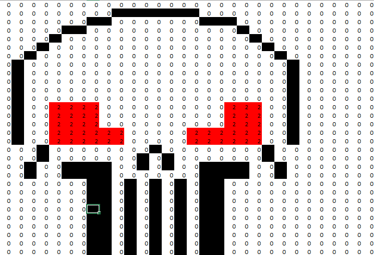
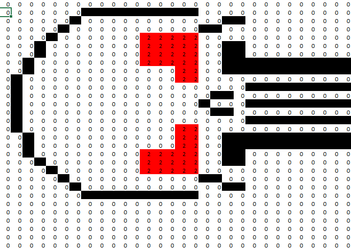
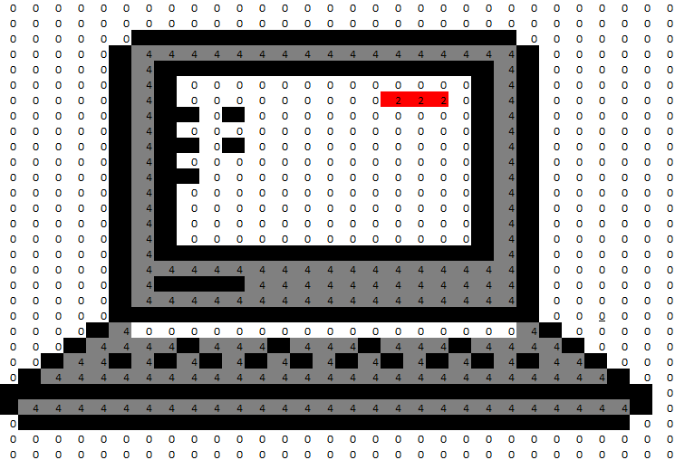
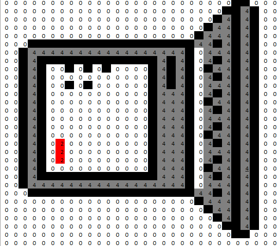
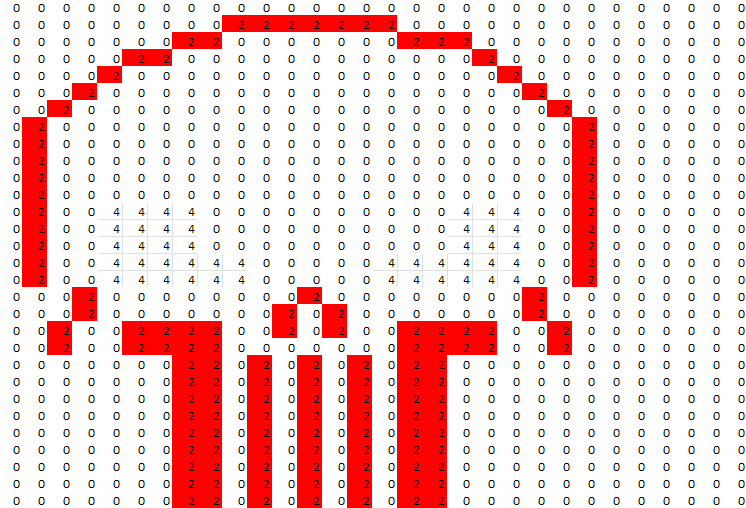
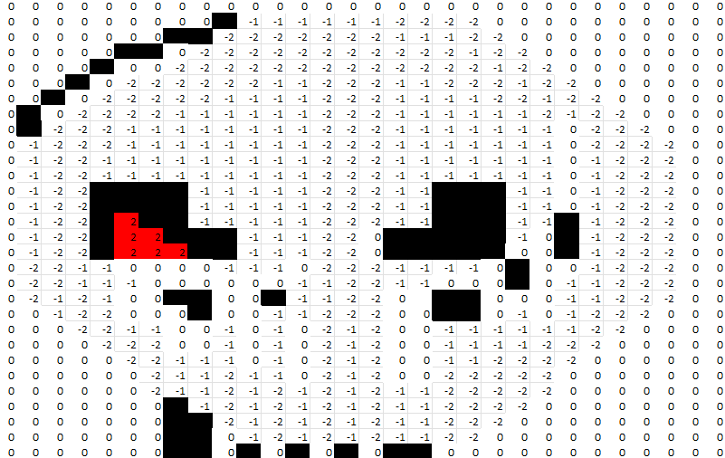
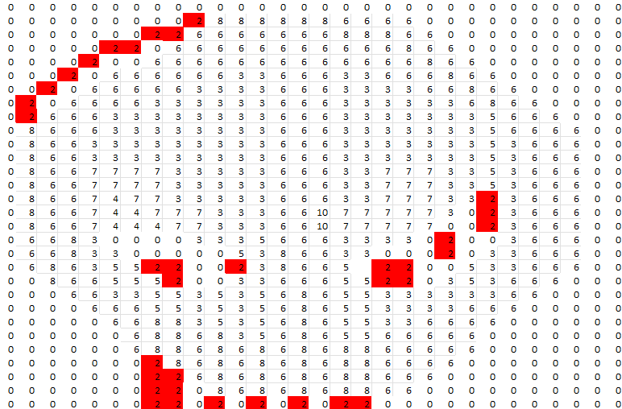

# Tecnológico de Software
## Materia: Fundamentos de Álgebra
## Alumno: David Morales Guerrero
## Actividad #20 – Operaciones Matriciales con Excel y GitHub

---

## 🎯 Objetivo
Aplicar operaciones matriciales básicas utilizando hojas de Excel programadas para realizar:

- Matriz numérica derivada de una imagen (pixel-art)
- Suma de matrices
- Resta de matrices
- Multiplicación escalar
- Transposición

Además, integrar el trabajo a un repositorio de GitHub utilizando formato Markdown.

---
## Imágenes del Proyecto

### Punisher (original)

### Punisher (traspuesta)

---

### Deadpool2 (original)

### Deadpool2 (traspuesta)

---

### Alien3 (original)

### Alien3 (traspuesta)

---

### Navi4 (original)

### Navi4 (traspuesta)

---

### Laptop5 (original)

### Laptop5 (traspuesta)

---

### Multiplicación escalar

### Suma de matrices

### Resta de matrices

### Combinación lineal

